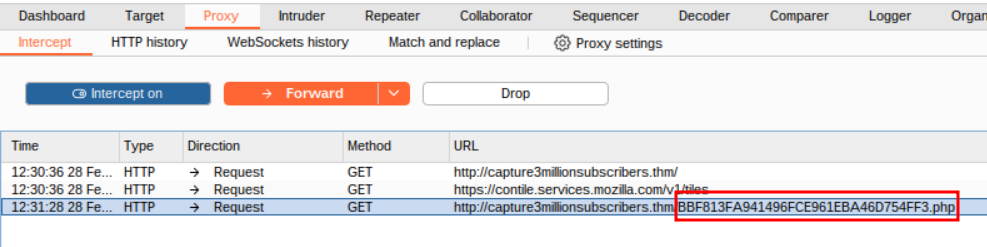
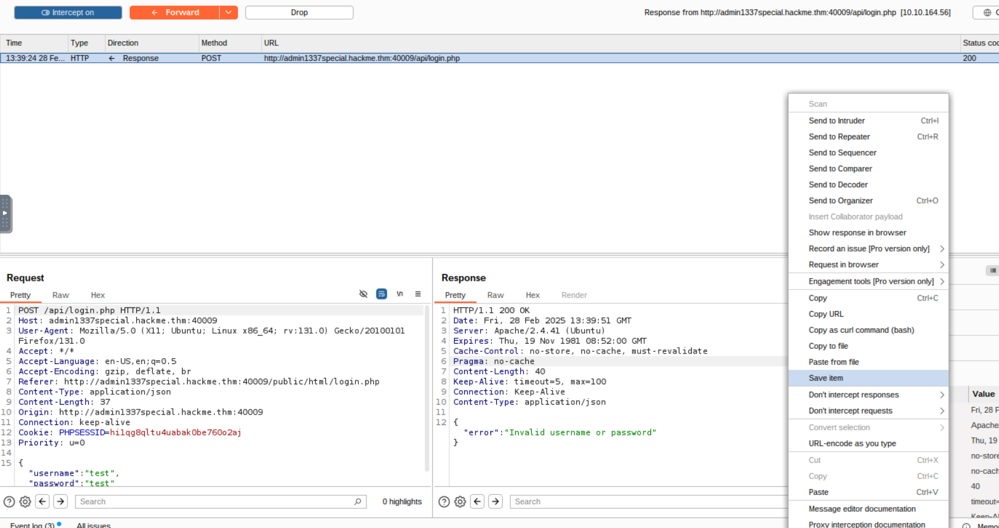
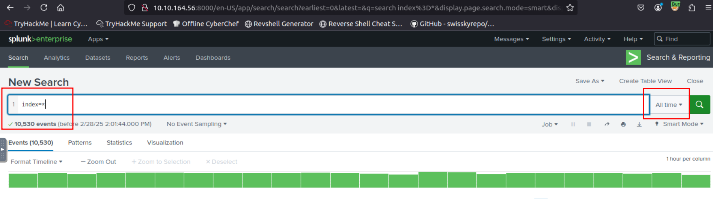

# TryHack3M: Subscribe - Walkthrough

### Task 2 - Exploitation

**1. What is the invite code for the hackme.thm website?**

Let's add the attacking machine in our `/etc/hosts` file and navigate to `http://hackme.thm` in our browser. When we click on the join for FREE button, we have a signup page, where we need a invite code to enter. On looking at the source code, nothing interesting found there.
 


Doing a simple nmap scan `nmap -p- -T4 10.10.236.10` followed by a in depth scan on the open ports


``` bash
root@ip-10-10-227-129:~# nmap -p 22,80,8000,8191,40009 -sV -O -T4 10.10.236.10
Starting Nmap 7.80 ( https://nmap.org ) at 2025-02-28 09:48 GMT
Nmap scan report for hackme.thm (10.10.236.10)
Host is up (0.00038s latency).

PORT      STATE SERVICE         VERSION
22/tcp    open  ssh             OpenSSH 8.2p1 Ubuntu 4ubuntu0.3 (Ubuntu Linux; protocol 2.0)
80/tcp    open  http            Apache httpd 2.4.41 ((Ubuntu))
8000/tcp  open  http            Splunkd httpd
8191/tcp  open  limnerpressure?
40009/tcp open  http            Apache httpd 2.4.41
1 service unrecognized despite returning data. If you know the service/version, please submit the following fingerprint at https://nmap.org/cgi-bin/submit.cgi?new-service :
SF-Port8191-TCP:V=7.80%I=7%D=2/28%Time=67C18673%P=x86_64-pc-linux-gnu%r(Ge
SF:tRequest,A9,"HTTP/1\.0\x20200\x20OK\r\nConnection:\x20close\r\nContent-
SF:Type:\x20text/plain\r\nContent-Length:\x2085\r\n\r\nIt\x20looks\x20like
SF:\x20you\x20are\x20trying\x20to\x20access\x20MongoDB\x20over\x20HTTP\x20
SF:on\x20the\x20native\x20driver\x20port\.\r\n")%r(FourOhFourRequest,A9,"H
SF:TTP/1\.0\x20200\x20OK\r\nConnection:\x20close\r\nContent-Type:\x20text/
SF:plain\r\nContent-Length:\x2085\r\n\r\nIt\x20looks\x20like\x20you\x20are
SF:\x20trying\x20to\x20access\x20MongoDB\x20over\x20HTTP\x20on\x20the\x20n
SF:ative\x20driver\x20port\.\r\n");
MAC Address: 02:D4:24:3C:F3:89 (Unknown)
Warning: OSScan results may be unreliable because we could not find at least 1 open and 1 closed port
Aggressive OS guesses: Linux 3.10 - 3.13 (95%), Linux 3.8 (95%), Linux 3.1 (95%), Linux 3.2 (95%), AXIS 210A or 211 Network Camera (Linux 2.6.17) (94%), ASUS RT-N56U WAP (Linux 3.4) (93%), Linux 3.16 (93%), Linux 2.6.32 (92%), Linux 2.6.39 - 3.2 (92%), Linux 3.1 - 3.2 (92%)
No exact OS matches for host (test conditions non-ideal).
Network Distance: 1 hop
Service Info: Host: default; OS: Linux; CPE: cpe:/o:linux:linux_kernel

OS and Service detection performed. Please report any incorrect results at https://nmap.org/submit/ .
Nmap done: 1 IP address (1 host up) scanned in 53.31 seconds
root@ip-10-10-227-129:~# 
```

On doing a directory scan using `dirb` `dirb http://hackme.thm/ -w /usr/share/wordlists/dirb/big.txt -r`

When we go to `http://hackme.thm/js/` we find a link to `invite.js` where we find some useful things


- The above code checks if the hostname is `capture3millionsubscribers.thm`. So let's add this in our `/etc/hosts` file


- Now to change this let's use `Burp`, capture the request and send it to the repeater.


- We have to change 
    - Path -> /inviteCode1337HM.php
    - Host -> capture3millionsubscribers.thm
    - Referer -> http://capture3millionsubscribers.thm/sign_up.php

- We get the Invite Code!


> VkXgo:Invited30MnUsers

**2. What is the password for the user guest@hackme.thm?**
Once we enter the code we get the password


> wedidit1010

**3. What is the secure token for accessing the admin panel?**

On intercepting the request to the VIP room, we find an interesting cookie that is being set `isVIP`

- Let's change this to true and see

We can view the content!!

So let's capture the request when we click on the VIP room and change the `isVIP` to true.
We observe an unusual request to `http://capture3millionsubscribers.thm/BBF813FA941496FCE961EBA46D754FF3.php`. 
 



On navigating to it while the `isVIP` is set to True we get a terminal

When we give the command `ls` it lists all the files in the directory, the token we are searching for can be found here `config.php`
| |  |

> Answer : ACC#SS_TO_ADM1N_P@NEL

**4. What is the flag value after enabling the registration feature and getting 3M subscribers on the platform?**

When we go to the URL `http://admin1337special.hackme.thm:40009/public/html/` in the config.php file, we get a forbidden message.

- Running `dirb` to see if there are other pages, we find a login page


I tried the guest credentials, but that did not work.
On entering `'` as the username and intercepting the request, we get an error

Let's save this request's response 
|  | |
- Using this response in sqlmap `sqlmap -r response --dbs`
    - `-r` here we give the saved response from burp    
    - `--dbs` this is used to enumerate the database
    
- Now enumerating the `hackme` database `sqlmap -r response -D hackme --tables`
    - `-D` specify the database we have to enumerate
    - `--tables` enumerate the tables of the DB
- Enumerating the `users` table `sqlmap -r response -D hackme -T users --dump`
    - `-T` specify the table name to enumerate
    - `--dump` dump the DB table entries
    
Once we get the credentials we can login as admin and change the action. Once we change it and go back to the site, we get the flag.


> Answer : TryHack3M{3MSUBSCRIBERS} 

***
### Task 3 - Detection

**1. How many logs are ingested in the Splunk instance?**



> Answer : 10530

**2. What is the web hacking tool used by the attacker to exploit the vulnerability on the website?**

Since we know the incident took place on `04/04/2024`, let's filter it accordingly
- We find one suspicious value in the uri, let's filter using this. We can see the tool that was used


> Answer : sqlmap

**3.How many total events were observed related to the attack?**

We should filter according the `user-agent`


> Answer : 158

**4. What is the observed IP address of the attacker?**


> Answer : 83.45.212.17  

**5. How many events were observed from the attacker's IP?**


> Answer 184

**6. What is the table used by the attacker to execute the attack?**

We can see the sql query that was performed in the `uri` field.


> Answer : TryHack3M_users