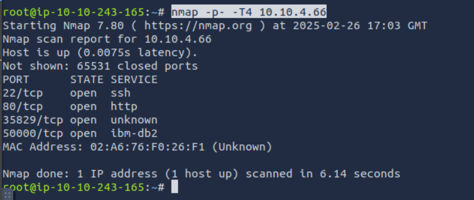
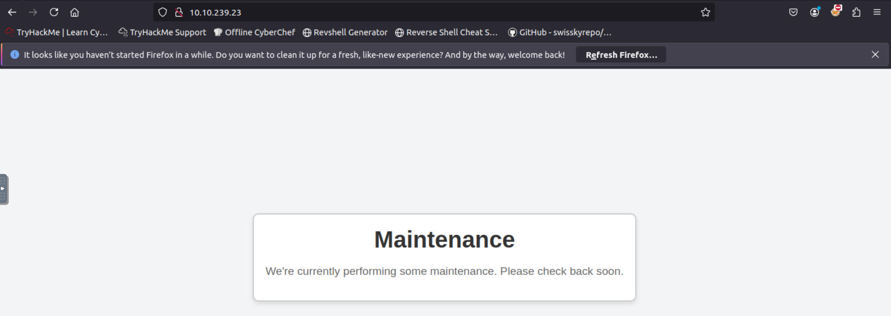
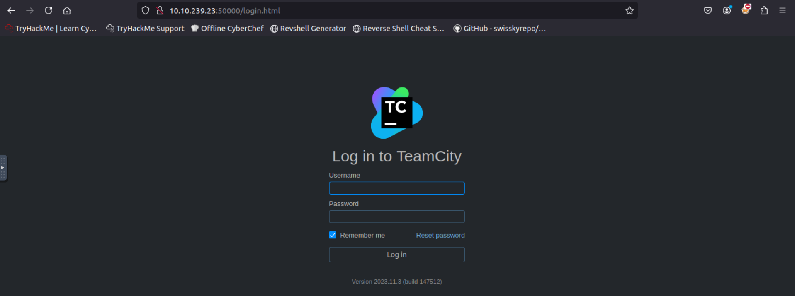
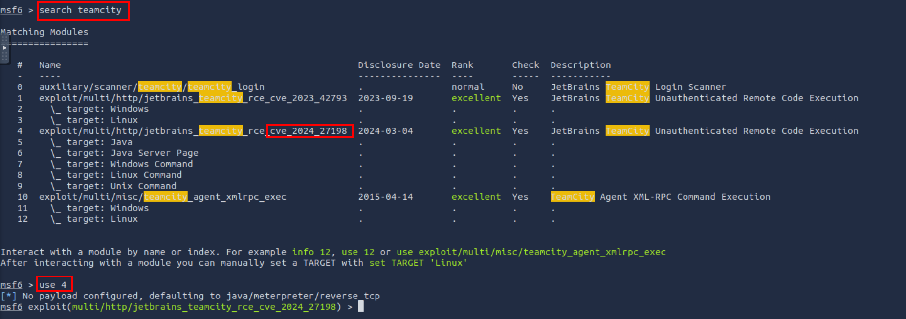
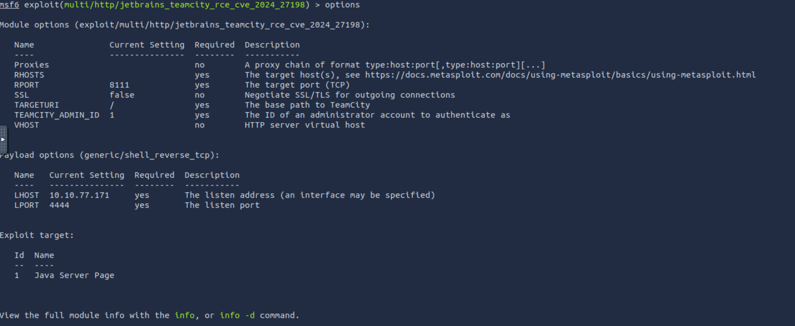
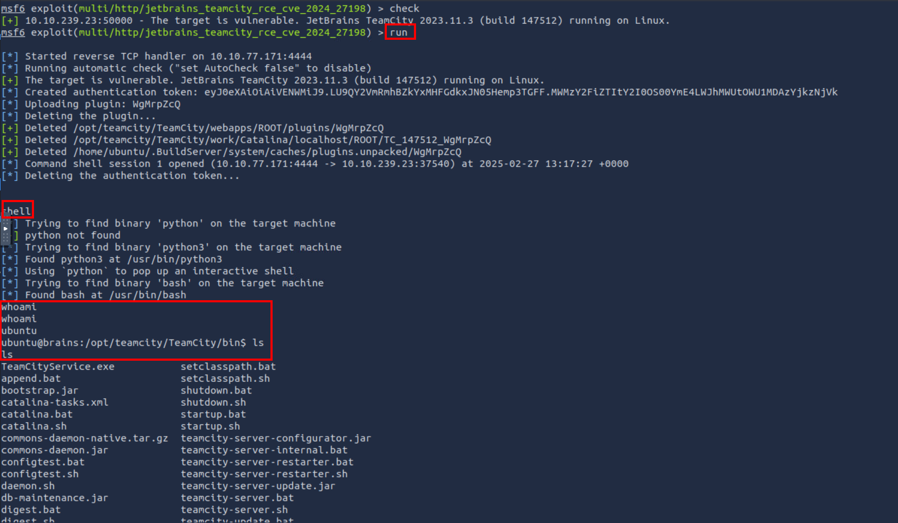
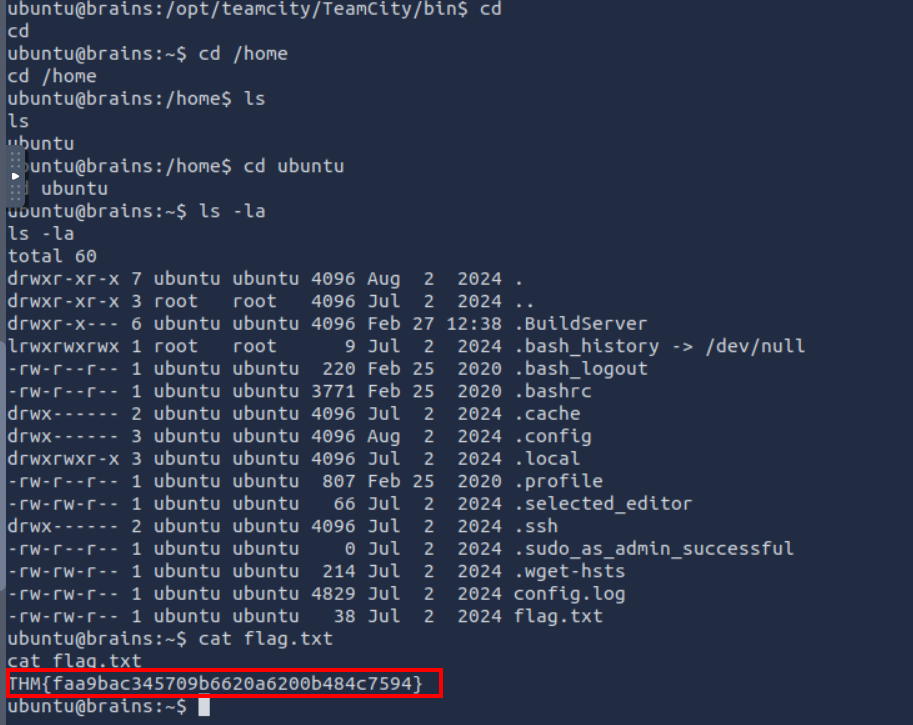
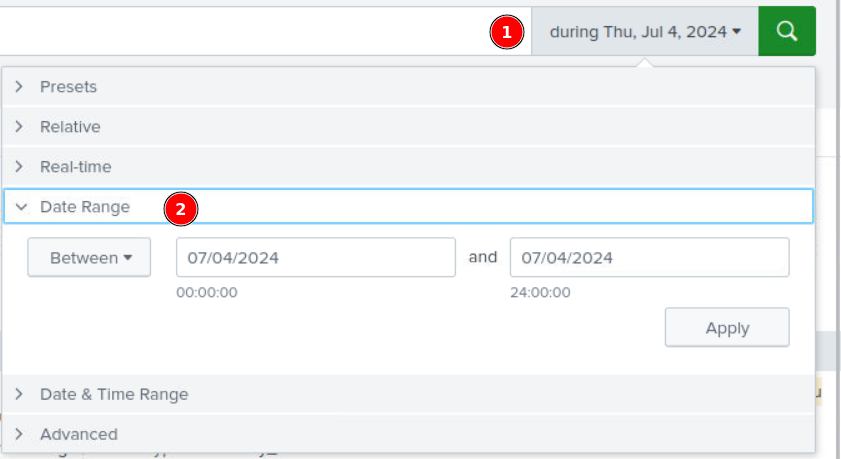
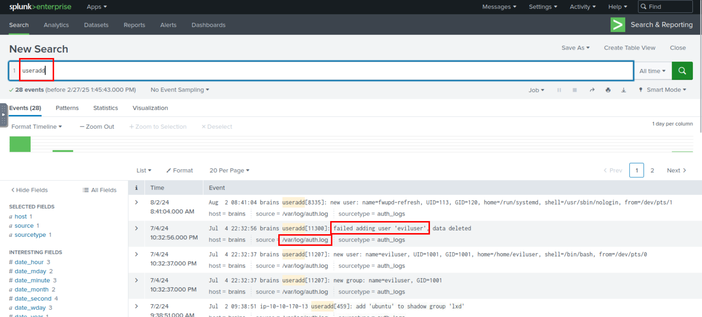
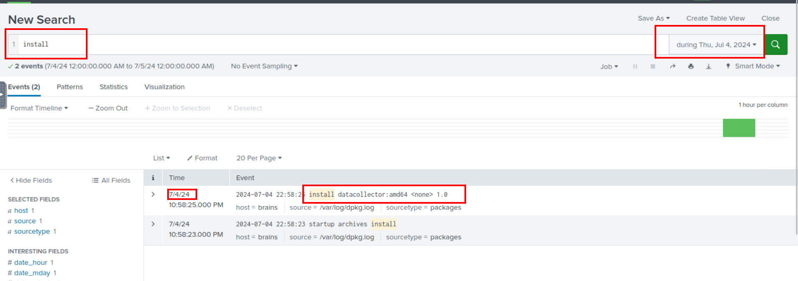

# Try Hack Me - Brains Walkthrough
The city forgot to close its gate.

# Enumeration

Starting off with a nmap scan `nmap -p- -T4 10.10.4.66`. 



We can do a more deep scan for the open ports:
```bash
root@ip-10-10-243-165:~# nmap -sC -sV -p 22,80,35829,50000 -T4 10.10.4.66
Starting Nmap 7.80 ( https://nmap.org ) at 2025-02-26 17:06 GMT
Nmap scan report for 10.10.4.66
Host is up (0.00024s latency).

PORT      STATE SERVICE  VERSION
22/tcp    open  ssh      OpenSSH 8.2p1 Ubuntu 4ubuntu0.11 (Ubuntu Linux; protocol 2.0)
80/tcp    open  http     Apache httpd 2.4.41 ((Ubuntu))
|_http-server-header: Apache/2.4.41 (Ubuntu)
|_http-title: Maintenance
35829/tcp open  java-rmi Java RMI
50000/tcp open  ibm-db2?
| fingerprint-strings: 
|   GetRequest: 
|     HTTP/1.1 401 
|     TeamCity-Node-Id: MAIN_SERVER
|     WWW-Authenticate: Basic realm="TeamCity"
|     WWW-Authenticate: Bearer realm="TeamCity"
|     Cache-Control: no-store
|     Content-Type: text/plain;charset=UTF-8
|     Date: Wed, 26 Feb 2025 17:06:49 GMT
|     Connection: close
|     Authentication required
|     login manually go to "/login.html" page
|   drda, ibm-db2, ibm-db2-das: 
|     HTTP/1.1 400 
|     Content-Type: text/html;charset=utf-8
|     Content-Language: en
|     Content-Length: 435
|     Date: Wed, 26 Feb 2025 17:06:49 GMT
|     Connection: close
|     <!doctype html><html lang="en"><head><title>HTTP Status 400 
|     Request</title><style type="text/css">body {font-family:Tahoma,Arial,sans-serif;} h1, h2, h3, b {color:white;background-color:#525D76;} h1 {font-size:22px;} h2 {font-size:16px;} h3 {font-size:14px;} p {font-size:12px;} a {color:black;} .line {height:1px;background-color:#525D76;border:none;}</style></head><body><h1>HTTP Status 400 
|_    Request</h1></body></html>
1 service unrecognized despite returning data. If you know the service/version, please submit the following fingerprint at https://nmap.org/cgi-bin/submit.cgi?new-service :
SF-Port50000-TCP:V=7.80%I=7%D=2/26%Time=67BF4A2A%P=x86_64-pc-linux-gnu%r(G
SF:etRequest,140,"HTTP/1\.1\x20401\x20\r\nTeamCity-Node-Id:\x20MAIN_SERVER
SF:\r\nWWW-Authenticate:\x20Basic\x20realm=\"TeamCity\"\r\nWWW-Authenticat
SF:e:\x20Bearer\x20realm=\"TeamCity\"\r\nCache-Control:\x20no-store\r\nCon
SF:tent-Type:\x20text/plain;charset=UTF-8\r\nDate:\x20Wed,\x2026\x20Feb\x2
SF:02025\x2017:06:49\x20GMT\r\nConnection:\x20close\r\n\r\nAuthentication\
SF:x20required\nTo\x20login\x20manually\x20go\x20to\x20\"/login\.html\"\x2
SF:0page")%r(ibm-db2-das,24E,"HTTP/1\.1\x20400\x20\r\nContent-Type:\x20tex
SF:t/html;charset=utf-8\r\nContent-Language:\x20en\r\nContent-Length:\x204
SF:35\r\nDate:\x20Wed,\x2026\x20Feb\x202025\x2017:06:49\x20GMT\r\nConnecti
SF:on:\x20close\r\n\r\n<!doctype\x20html><html\x20lang=\"en\"><head><title
SF:>HTTP\x20Status\x20400\x20\xe2\x80\x93\x20Bad\x20Request</title><style\
SF:x20type=\"text/css\">body\x20{font-family:Tahoma,Arial,sans-serif;}\x20
SF:h1,\x20h2,\x20h3,\x20b\x20{color:white;background-color:#525D76;}\x20h1
SF:\x20{font-size:22px;}\x20h2\x20{font-size:16px;}\x20h3\x20{font-size:14
SF:px;}\x20p\x20{font-size:12px;}\x20a\x20{color:black;}\x20\.line\x20{hei
SF:ght:1px;background-color:#525D76;border:none;}</style></head><body><h1>
SF:HTTP\x20Status\x20400\x20\xe2\x80\x93\x20Bad\x20Request</h1></body></ht
SF:ml>")%r(ibm-db2,24E,"HTTP/1\.1\x20400\x20\r\nContent-Type:\x20text/html
SF:;charset=utf-8\r\nContent-Language:\x20en\r\nContent-Length:\x20435\r\n
SF:Date:\x20Wed,\x2026\x20Feb\x202025\x2017:06:49\x20GMT\r\nConnection:\x2
SF:0close\r\n\r\n<!doctype\x20html><html\x20lang=\"en\"><head><title>HTTP\
SF:x20Status\x20400\x20\xe2\x80\x93\x20Bad\x20Request</title><style\x20typ
SF:e=\"text/css\">body\x20{font-family:Tahoma,Arial,sans-serif;}\x20h1,\x2
SF:0h2,\x20h3,\x20b\x20{color:white;background-color:#525D76;}\x20h1\x20{f
SF:ont-size:22px;}\x20h2\x20{font-size:16px;}\x20h3\x20{font-size:14px;}\x
SF:20p\x20{font-size:12px;}\x20a\x20{color:black;}\x20\.line\x20{height:1p
SF:x;background-color:#525D76;border:none;}</style></head><body><h1>HTTP\x
SF:20Status\x20400\x20\xe2\x80\x93\x20Bad\x20Request</h1></body></html>")%
SF:r(drda,24E,"HTTP/1\.1\x20400\x20\r\nContent-Type:\x20text/html;charset=
SF:utf-8\r\nContent-Language:\x20en\r\nContent-Length:\x20435\r\nDate:\x20
SF:Wed,\x2026\x20Feb\x202025\x2017:06:49\x20GMT\r\nConnection:\x20close\r\
SF:n\r\n<!doctype\x20html><html\x20lang=\"en\"><head><title>HTTP\x20Status
SF:\x20400\x20\xe2\x80\x93\x20Bad\x20Request</title><style\x20type=\"text/
SF:css\">body\x20{font-family:Tahoma,Arial,sans-serif;}\x20h1,\x20h2,\x20h
SF:3,\x20b\x20{color:white;background-color:#525D76;}\x20h1\x20{font-size:
SF:22px;}\x20h2\x20{font-size:16px;}\x20h3\x20{font-size:14px;}\x20p\x20{f
SF:ont-size:12px;}\x20a\x20{color:black;}\x20\.line\x20{height:1px;backgro
SF:und-color:#525D76;border:none;}</style></head><body><h1>HTTP\x20Status\
SF:x20400\x20\xe2\x80\x93\x20Bad\x20Request</h1></body></html>");
MAC Address: 02:A6:76:F0:26:F1 (Unknown)
Service Info: OS: Linux; CPE: cpe:/o:linux:linux_kernel

Service detection performed. Please report any incorrect results at https://nmap.org/submit/ .
Nmap done: 1 IP address (1 host up) scanned in 13.60 seconds
root@ip-10-10-243-165:~# 
```

> I have restarted the session, hence the change in the attacking IP

We get a message when we navigate to `http://10.10.239.23`, even on viewing the source of this page, we find nothing useful.


Checking `http://10.10.239.23:50000/`, we have a login page


On searching on google, TeamCity is a continuous integration server developed by JetBrains (ummm.....hence the room name).
- On the login page we also get the version of this, and this version is vulnerable to authentication bypass allowing to perform admin actions (CVE-2024-27198).

# Exploitation

- Searching in `msfconsole` there is a exploit available

- Once we choose the exploit, these are the default options

- We have to set the following options and run the exploit
```bash
# setting RHOST and RPORT as attacking machine IP and PORT
set RHOSTS 10.10.239.23
set RPORT 50000
```

We get a shell! And the user flag


**1. What is the content of flag.txt in the user's home folder?**
>THM{faa9bac345709b6620a6200b484c7594}

***

Proceeding with **Task 2**

**1. What is the name of the backdoor user which was created on the server after exploitation?**
 > eviluser

As we have to search for the user that was added, we can search for `useradd` in splunk and we find a suspicous name.



**2. What is the name of the malicious-looking package installed on the server?**

> datacollector

We know from our previous search that the date the user was added was 07/04/2024. So filtering our search for installing on that date we get the package name.
 

**3. What is the name of the plugin installed on the server after successful exploitation?.**

> AyzzbuXY.zip

Now searching for `plugin` on the same date range we find out plugin that was installed after exploitation.


